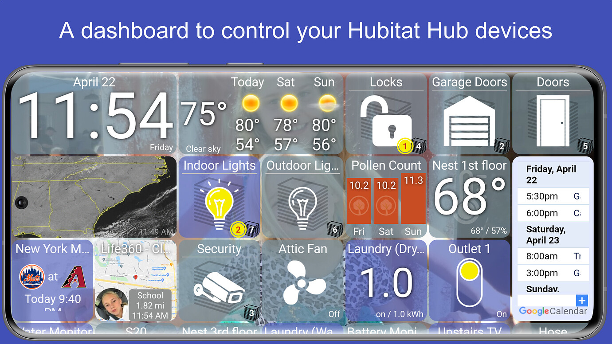
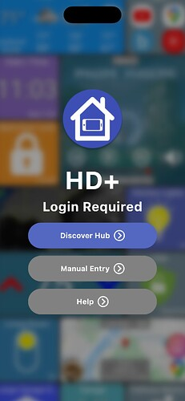
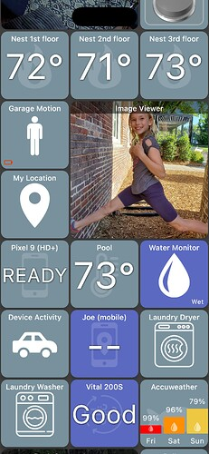
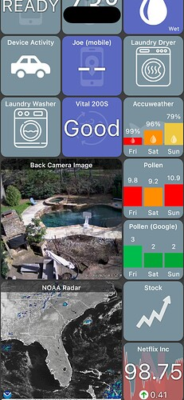
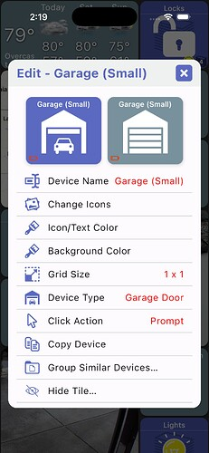
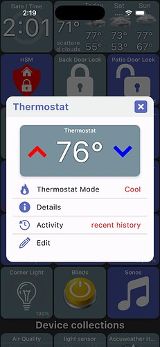
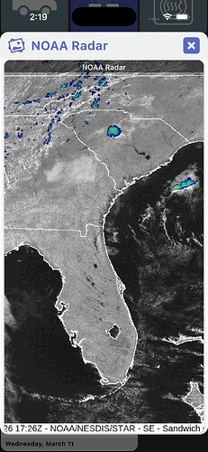
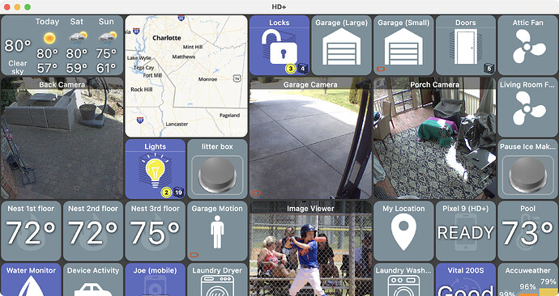
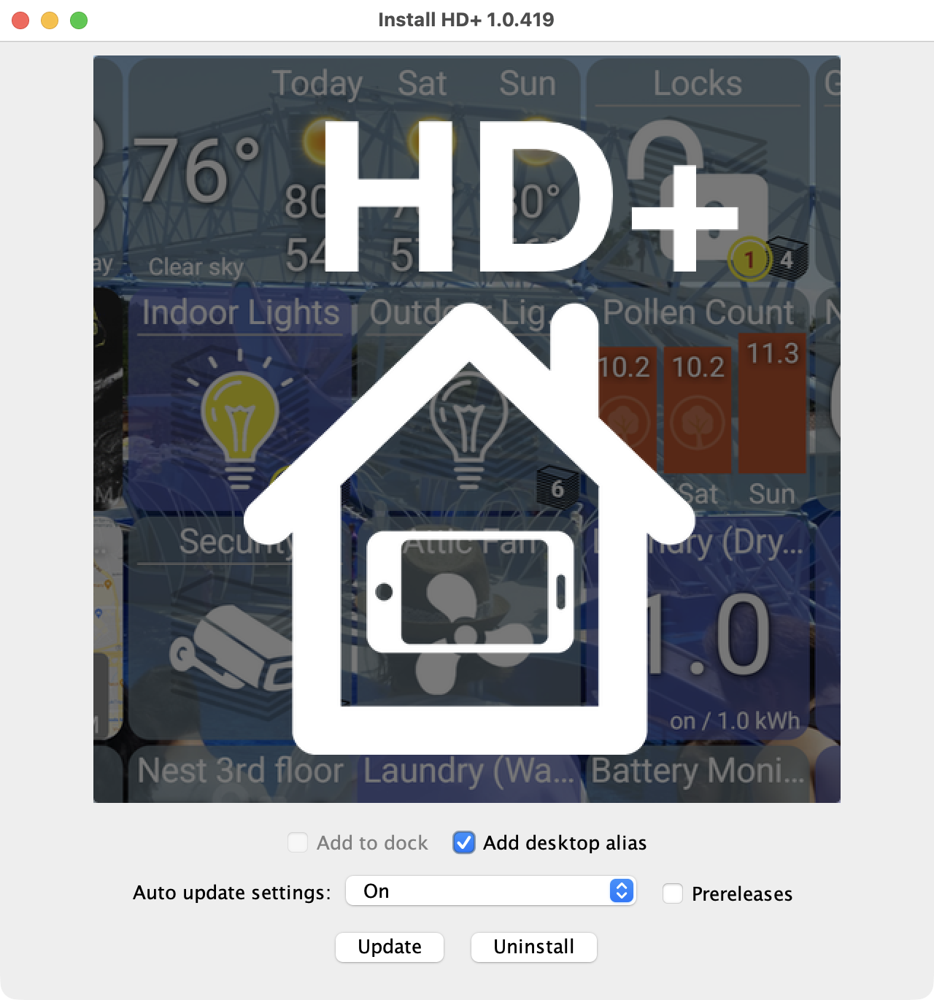

# Hubitat Dashboard (HD+)

HD+ is a multiplatform app to control all of your Hubitat Hub devices. It supports Android, iOS (coming soon!), Mac, Windows and Linux platforms.

# Features

- **auto login** will discover your Hubitat Hub on local network using UPnP (iOS doesn't support UPnP so it just tries to reach the hub using hubitat.local)
- **auto organize devices** when first logging in - including ability to organize 4 or more devices of the same type (ie: lights, locks, etc) into a folder
- display **full screen** - (Android & iOS)
- **keep the screen on** - (Android & iOS)
- **Flexible** - fully customize the interface (icons, tile size, text size, colors)
- All traffic is **LOCAL** to your network. No 3rd party server is used. There is also a remote access option (uses `cloud.hubitat.com`) that can be setup for use outside the house.
- **Drag and Drop** sorting
- **Group by Device Type** - automatically group device into folders (ie: group by 'Indoor Lights')
- **Supports MANY device types** and continually adding support for new devices
- **Custom Device Support** like auto-refreshing images, video, [Battery Monitor](https://joe-page-software.gitbook.io/hubitat-dashboard/tiles/battery-monitor) , Pollen Count, Dad Jokes, etc!
- **Widget Support** - put any tile on your [homescreen](https://joe-page-software.gitbook.io/hubitat-dashboard/features/widgets) (Android)
- **Presence Support** - pick a location and have the app update your [presence](https://joe-page-software.gitbook.io/hubitat-dashboard/features/presence-tracking-geofence) (home/away) on the Hubitat (Android)
- **Free and no ads** - I won't charge anyone to use this app.

---

# Screenshots

### iOS

|  |        |   |
| ------------------ | ------------------------ | ------------------- |
|  |  |  |

### Desktop

---

# Install

### iPhone / iPad (Coming Soon!)

If you're interested in testing the iOS (iPhone, iPad) version, I'll try to setup a way to test using Apple's [TestFlight](https://developer.apple.com/testflight/). Just send me a private message [here](https://community.hubitat.com/t/coming-soon-hd-hubitat-dashboard-for-ios-mac-windows-linux/162249/1) with your email address and once it's ready I'll add you to the list.

### Desktop (Mac, Windows, Linux)

I'm using an app/tool called JDeploy which handles building an installer for Mac/Windows/Linux and also auto-updates the app with no extra work!

Download your platform's installer [here](https://github.com/jpage4500/HubitatDashboard/releases)

When installing, keep the box labeled 'update automatically' checked and each time you run the app it'll check for the latest and update.
 

### Android

Download the Android version [here](https://community.hubitat.com/t/release-hd-android-dashboard/41674/1)

---

# Setup and Login

Once the app is installed, you still need to do 2 more things to login and use it. The instructions are the same as the Android version of HD+

1. Configure MakerAPI on the Hubitat  
    [Configure Hubitat Hub](https://joe-page-software.gitbook.io/hubitat-dashboard/setup/configure-hubitat-hub)
2. Login from the app  
    [Login](https://joe-page-software.gitbook.io/hubitat-dashboard/setup/login)

---

# Support

- [Support WIKI Page](https://joe-page-software.gitbook.io/hubitat-dashboard)
- [Android Community](https://community.hubitat.com/t/release-hd-android-dashboard/41674/1)
- [iOS / Desktop Community](https://community.hubitat.com/t/coming-soon-hd-hubitat-dashboard-for-ios-mac-windows-linux/162249/1)

Bugs are expected but feel free to report anything to the community support link above. If you can include a screenshot and device logs that'll help me see and reproduce the issue so that's the #1 way to get support. You can send device logs by opening the **Menu -> About -> Support**

Keep in mind at this stage things may and likely will break as I iterate versions, figure out how to get builds posted, etc. Please be patient! I have a day job and 2 very active kids so this is primarily what I work on during my free time.