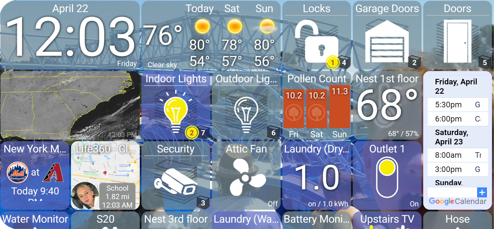
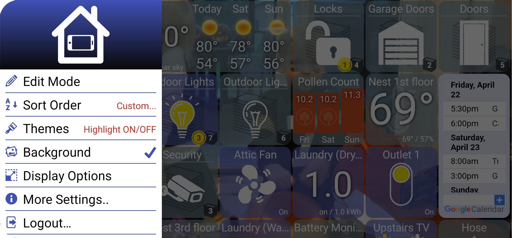

# Overview

### What is it?

**HD+** is a multi-platform app for viewing and controlling your Hubitat Hub devices. It was originally designed for wall mounted tablets but also works on phones, tablets, laptops, etc

My goal with this project is to create a dashboard with a great interface that's easy to get started with. No need to create a custom dashboard to see your devices.

### Features

* **Easy to login** - The app can find your Hub and login automatically
* **Full screen** (immersive) interface - no status bar or navigation arrows in the way _\*Android/iOS_
* **Keep the screen on** - full brightness during user-configurable hours (ie: 8 AM - 10 PM). Outside of those hours the screen will go off and will turn back on again _\*Android_
* **Multiple sort order options** plus custom drag and drop sorting
* **Adjust the tile size**. The tiles will always fill the space uniformly
* **Consistent user interface** (on/off icons, status, battery, temp, etc)
* **Widget Support**. 1-click toggle lights from the home screen, view auto-refreshing images _\*Android_
* **Video (RTSP) Support.** View multiple live camera streams
* **Geofencing**. The app will notify a Hubitat device as present/away _\*Android/iOS_
* **Works on older Android devices** - down to 4.4 (KitKat) _\*Android_
* **All traffic is LOCAL** to your network. No 3rd party server is used. There is also a remote access option (uses cloud.hubitat.com) that can be setup for use outside the house.
* **FAST** - This isn't another dashboard in a browser. device updates shouldn't force the entire screen to be refreshed. This is where my 20+ years of mobile development experience can really help.
* **Free - No Ads** - I won't charge anyone to use this app.

### Screenshots

.png>)

.png>)

.png>)

.png>)

_sha: 69bd5f3daef35b6314bb4b8e0ec393cc24a772fe58b2608ed6c7cdfe946a8195_

