# Hubitat Dashboard (HD+)

HD+ is a multiplatform app to view and control all of your Hubitat Hub devices. It runs on iPhone,
iPad, Android, Mac, Windows and Linux — and all traffic stays **local** to your network.

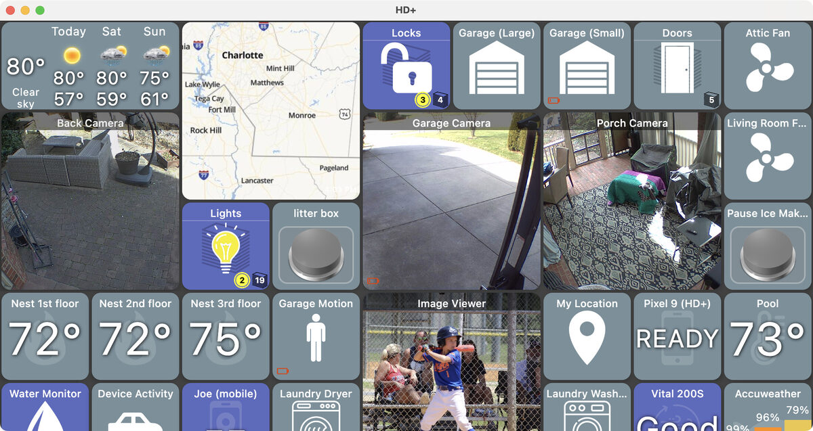

---

# Install

### iPhone / iPad

Download on the [App Store](https://apps.apple.com/us/app/hd-dashboard/id6759614539).

There's also a [TestFlight beta](https://testflight.apple.com/join/Wdb6CEUh) which gets updates first.

### Android

Download on [Google Play](https://play.google.com/store/apps/details?id=com.jpage4500.hd), or join
the [beta](https://play.google.com/apps/testing/com.jpage4500.hd) to get updates earlier.

There's also a sideload version with a few features that aren't in the Play version — download the
latest `.apk` from [Releases](https://github.com/jpage4500/HubitatDashboard/releases) and update from
inside the app afterwards (**About → Check for updates**).

### Desktop (Mac, Windows, Linux)

I'm using an app/tool called JDeploy which handles building an installer for Mac/Windows/Linux and
also auto-updates the app with no extra work!

Download your platform's installer [here](https://github.com/jpage4500/HubitatDashboard/releases).

When installing, keep the box labeled 'update automatically' checked and each time you run the app
it'll check for the latest and update.
 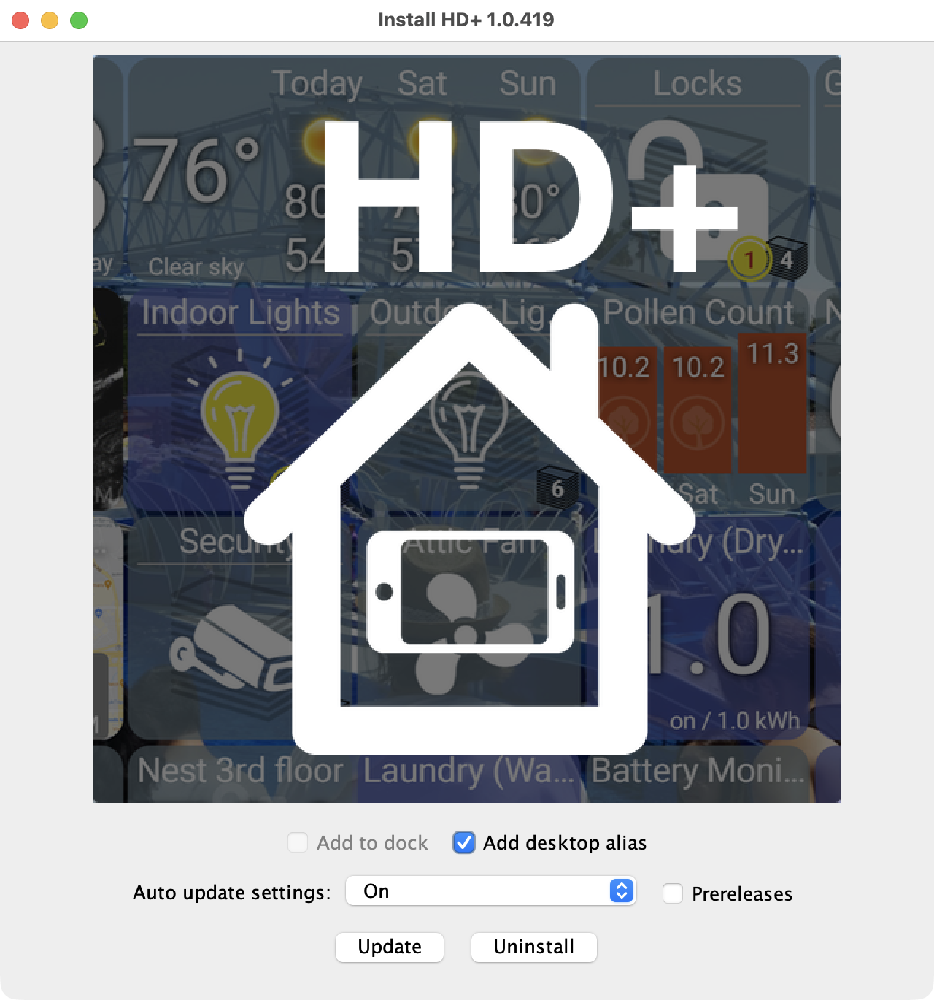

---

# Features

- **auto discover Hubitat Hub** on your local network using UPnP (iOS doesn't support UPnP so it just tries to reach the hub using `hubitat.local`)
- **auto organize devices** when first logging in - including ability to organize 4 or more devices of the same type (ie: lights, locks, etc) into a folder
- display **full screen** - *(Android & iOS)*
- **keep the screen on** - full brightness during the hours you choose *(Android & iOS)*
- **Flexible** - fully customize the interface (icons, tile size, text size, colors)
- All traffic is **LOCAL** to your network. No 3rd party server is used. There is also a remote access option (uses `cloud.hubitat.com`) that can be setup for use outside the house.
- **Drag and Drop** sorting
- **Group by Device Type** - automatically group devices into folders (ie: group by 'Indoor Lights')
- **Supports MANY device types** and continually adding support for new devices
- **Custom Device Support** - many custom Hubitat apps and drivers work here with no extra effort: [Blink](https://community.hubitat.com/t/project-driver-for-blink-api/51257), [Life360+](https://community.hubitat.com/t/life360/118544), [Google Photos](https://joe-page-software.gitbook.io/hubitat-dashboard/tiles/google-photos), [GameTime](https://community.hubitat.com/t/release-gametime-pro-college-sports-schedules-integration/71755/1), [OpenWeatherMap](https://community.hubitat.com/t/openweathermap-alerts-weather-driver/38249), [Hub Information Driver](https://community.hubitat.com/t/release-hub-information-driver-v3/109902)
- **Live Video** (RTSP) support
- **Auto-refreshing images**
- **[Hubitat Safety Monitor](https://docs2.hubitat.com/en/apps/hubitat-safety-monitor)** and **[Mode](https://docs2.hubitat.com/en/user-interface/settings/modes)** support
- **Screensaver** with wake on motion and auto-updating images - turn a wall mounted tablet into a picture frame at night
- **Widget Support** - put any tile on your [homescreen](https://joe-page-software.gitbook.io/hubitat-dashboard/features/widgets) *(Android)* and Apple **Shortcuts** *(iOS)*
- **Android Auto** and **Apple CarPlay** support
- **Presence Support** - pick a location and have the app update your [presence](https://joe-page-software.gitbook.io/hubitat-dashboard/features/presence-tracking-geofence) (home/away) on the Hubitat
- **HTML** tiles
- **MANY** more tiles - [Battery Monitor](https://joe-page-software.gitbook.io/hubitat-dashboard/tiles/battery-monitor), Pollen Count, Dad Jokes, stocks, radar, calendar and more. Full list [here](https://joe-page-software.gitbook.io/hubitat-dashboard)
- **Free and no ads** - I won't charge anyone to use this app.

---

# Screenshots

### iPhone

| 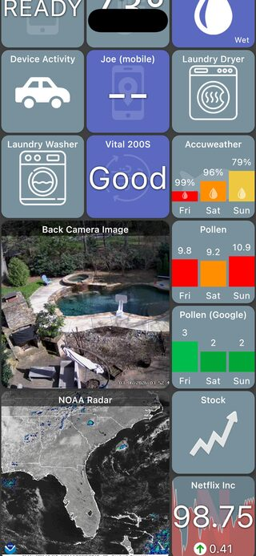 | 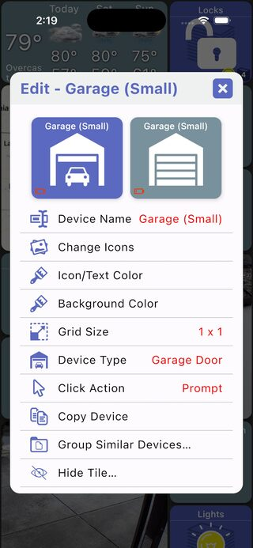 | 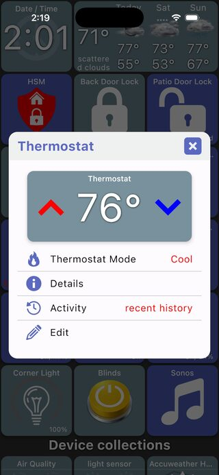 |
| --- | --- | --- |

### iPad

| 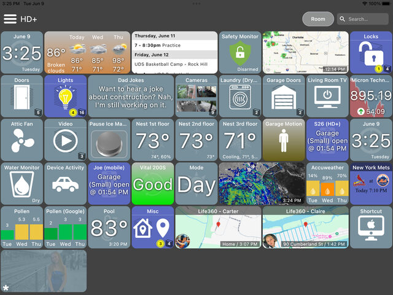 | 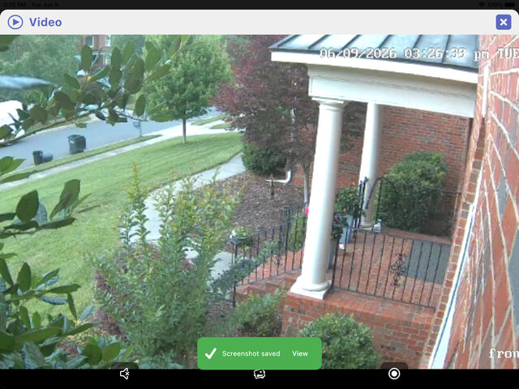 | 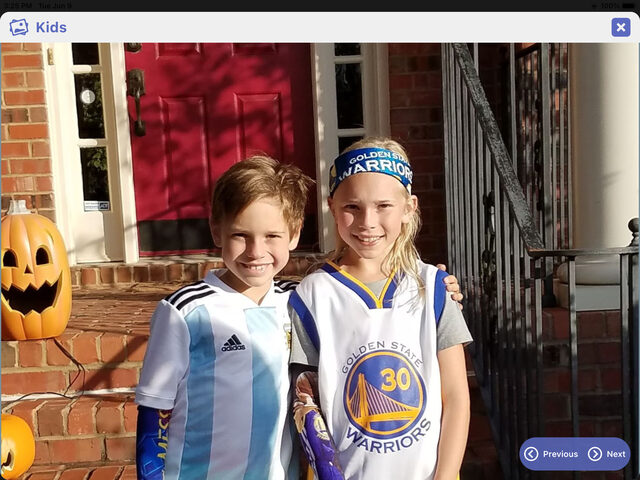 |
| --- | --- | --- |

### Android

| 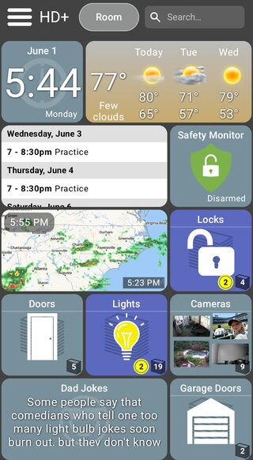 | 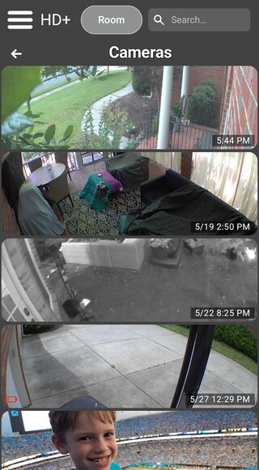 | 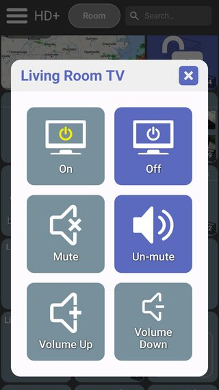 |
| --- | --- | --- |

### Desktop

| 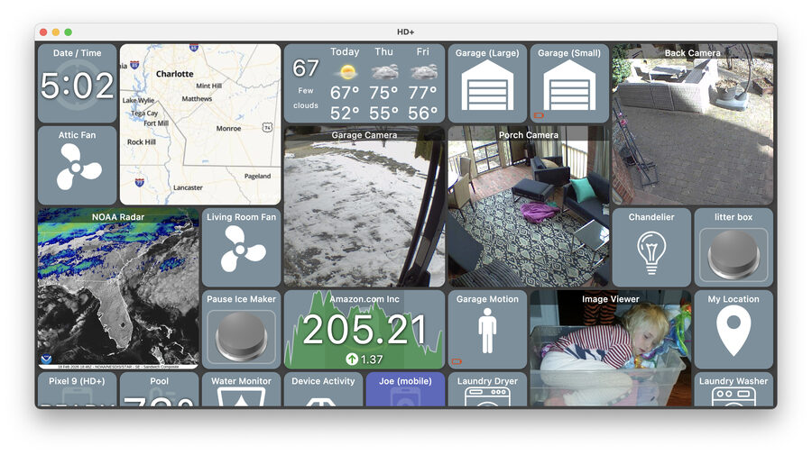 | 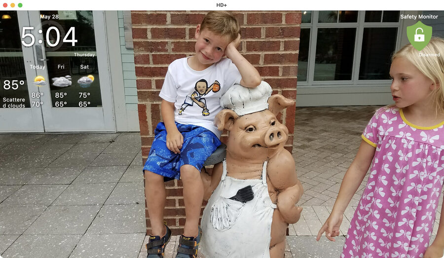 |
| --- | --- |

### Apple CarPlay / Android Auto

| 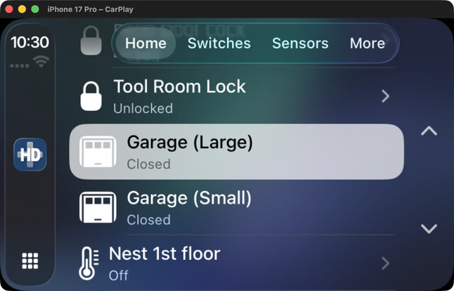 | 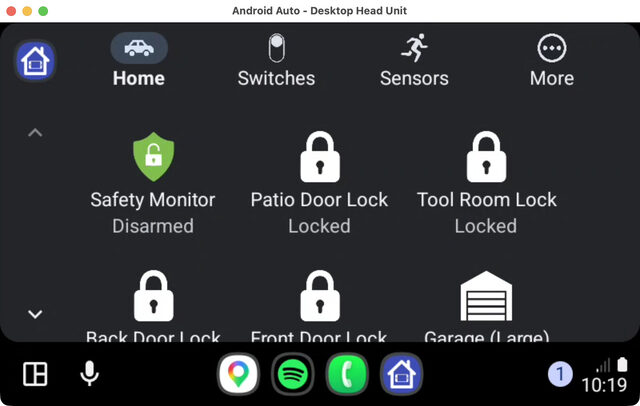 |
| --- | --- |

---

# Setup and Login

Once the app is installed, you still need to do 2 more things to login and use it. The instructions
are the same as the Android version of HD+

1. Configure MakerAPI on the Hubitat
   [Configure Hubitat Hub](https://joe-page-software.gitbook.io/hubitat-dashboard/setup/configure-hubitat-hub)
2. Login from the app
   [Login](https://joe-page-software.gitbook.io/hubitat-dashboard/setup/login)

**NOTE:** iOS doesn't support UPnP, so the 'discover' button just tries to reach the hub at
`hubitat.local`. If that doesn't work on your network, enter your hub's IP address and the app can
still find the Maker API app ID and tokens for you.

---

# Guides

- [Wake an iPad every morning](docs/public/ios-wake.md) - let the screen sleep overnight and have the dashboard back on the wall before you are. Covers the smart-plug + Shortcuts trick, Dashboard Mode's night options and Guided Access kiosk mode.

---

# Support

- [Support WIKI Page](https://joe-page-software.gitbook.io/hubitat-dashboard)
- [Community thread](https://community.hubitat.com/t/release-hd-hubitat-dashboard-for-ios-android-mac-windows-linux/162249) - iOS, Android, Mac, Windows and Linux
- [Original HD+ for Android](https://community.hubitat.com/t/release-hd-android-dashboard/41674) - still recommended for older devices and Fire tablets

Bugs are expected but feel free to report anything to the community link above. If you can include a
screenshot and device logs that'll help me see and reproduce the issue so that's the #1 way to get
support. You can send device logs by opening the **Menu -> About -> Support**

Keep in mind at this stage things may and likely will break as I iterate versions, figure out how to
get builds posted, etc. Please be patient! I have a day job and 2 very active kids so this is
primarily what I work on during my free time.

---

# Donate

The app is free and always will be, but if you'd like to support it a donation is much appreciated —
[PayPal](https://www.paypal.com/paypalme/jpage4500) or [Venmo](https://www.venmo.com/u/jpage4500).
