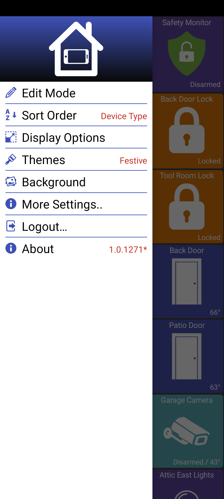
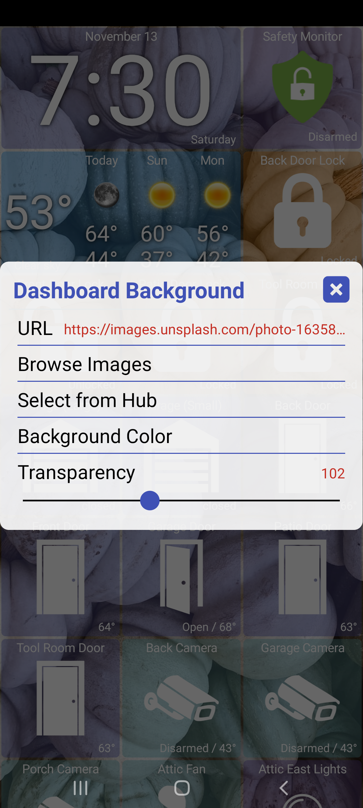
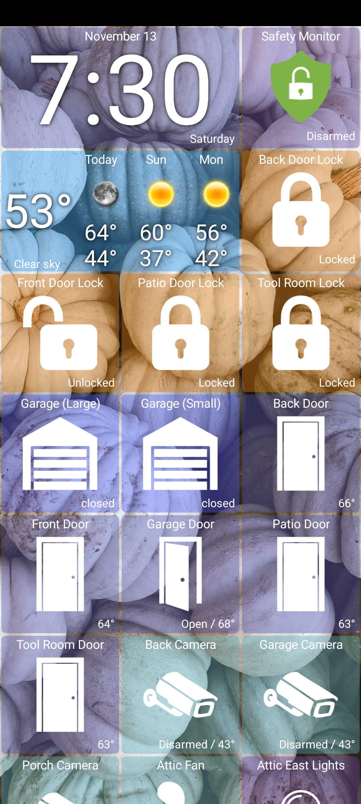
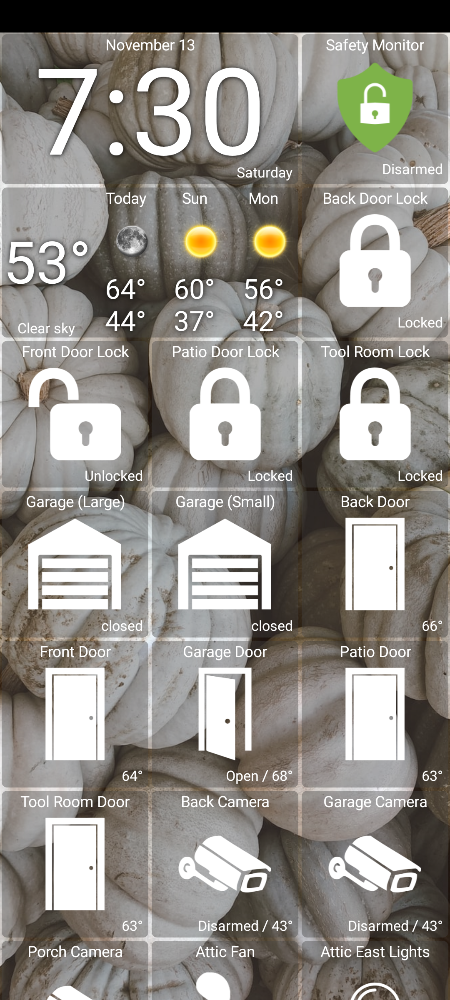
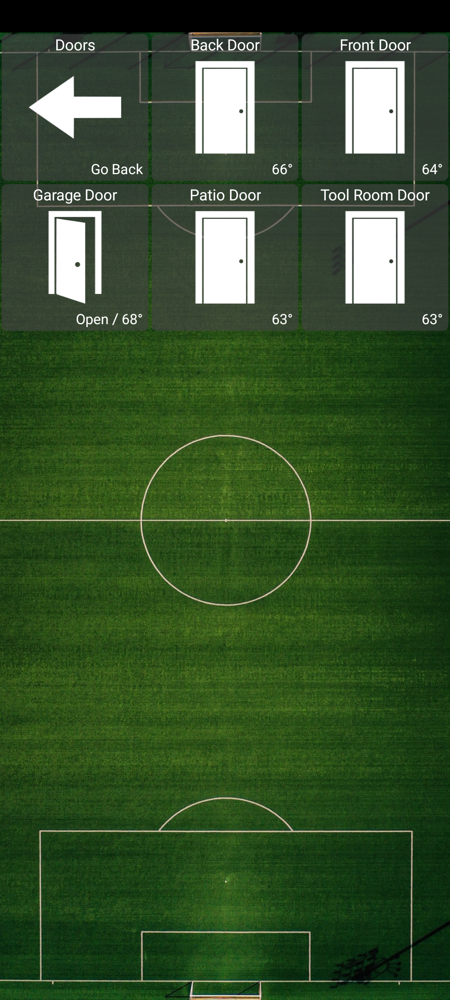
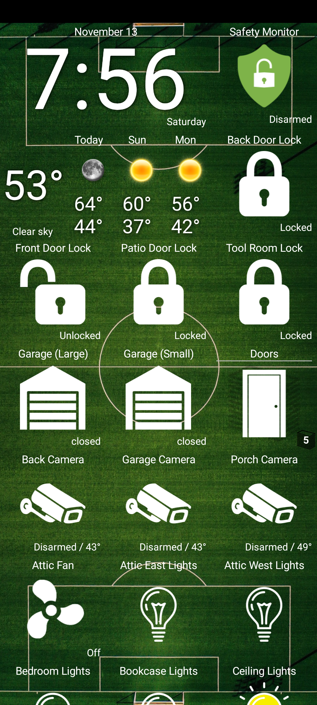
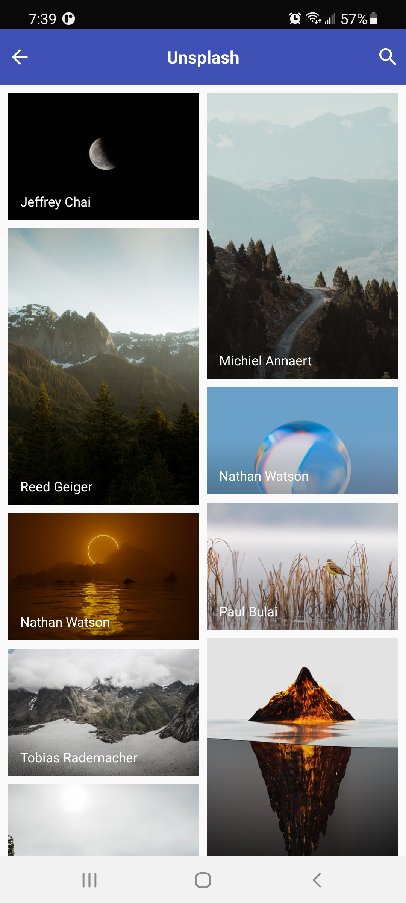

# Background

To get started, select Background from the navigation drawer / menu and:

* Enter an image URL
* Browse images from unsplash.com
* Select an image saved on your Hub's [filemanager](http://hubitat.local/hub/fileManager)
* Control how much of the background shows by changing the Transparency setting - from 0 (fully transparent) to 255 (fully opaque)

## Advanced

* Use [Google Photos](../tiles/google-photos/README.md#use-google-photos-as-a-background) device as your background image
