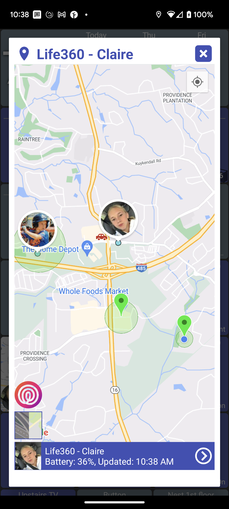

# Location (Life360)

[Life360](https://www.life360.com/) is a location sharing application for tracking families.&#x20;

### Getting Started

* First, install and configure the Life360 mobile app on one or more devices ([Android](https://play.google.com/store/apps/details?id=com.life360.android.safetymapd\&hl=en_US\&gl=US) / [iOS](https://apps.apple.com/us/app/life360-find-family-friends/id384830320))
* Next, install the "[Life360+](https://community.hubitat.com/t/release-life360/118544)" Hubitat app/driver and configure it
* Finally, make sure all of the Life360 devices which are created by the Life360+ driver are checked in [MakerAPI](../../../setup/install-configure.md)

### Dashboard Tile

* The dashboard tile shows the user's location on a static Google Map image\
  .png>)
* clicking on the tile shows an embedded Google Map
* 
  * NOTE: any other Life360 or OwnTracks devices that you have will also be displayed on the map as well

### Widget

* You can also create a homescreen widget out of any Life360 device

