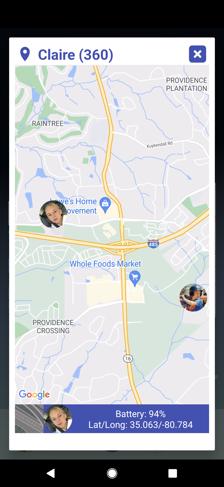
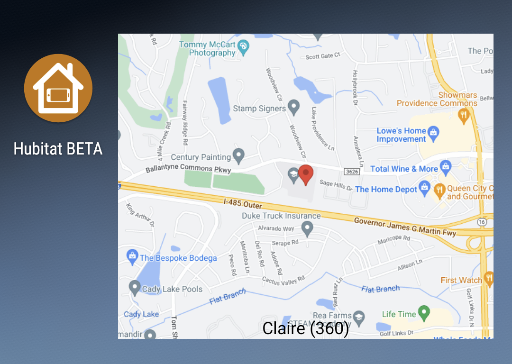

# Location (OwnTracks)

OwnTracks is a location sharing application for tracking families.&#x20;

### Getting Started

* First, install and configure the OwnTracks app on one or more devices ([Android](https://play.google.com/store/apps/details?id=org.owntracks.android\&hl=en_US\&gl=US) / [iOS](https://apps.apple.com/us/app/owntracks/id692424691))
* Next, install the "[OwnTracks Presence](https://community.hubitat.com/t/release-owntracks-presence/53419/1)" hubitat driver and configure it
* Finally, make sure all of the OwnTracks devices are checked in [MakerAPI](../../setup/install-configure.md)

### Dashboard Tile

* The dashboard tile shows the user's location on a static Google Map image\
  .png>)
* clicking on the tile shows an embedded Google Map\
  
  * NOTE: any other Life360 or OwnTracks devices that you have will also be displayed on the map as well

### Widget

* You can also create a homescreen widget out of any OwnTracks device

