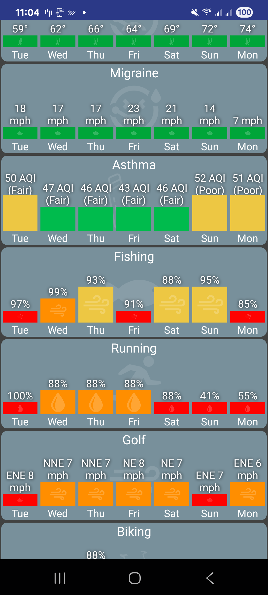
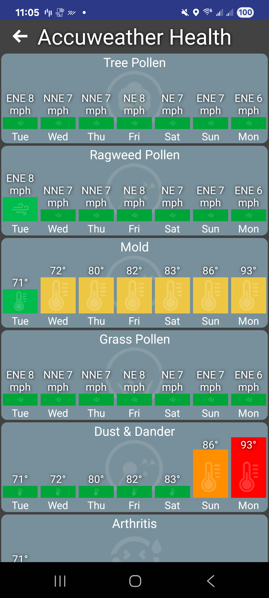
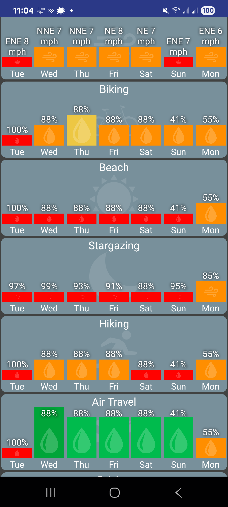

# Accuweather Health

Accuweather.com offers many types of heath forecasts which HD+ can display as a tile.

<figure><figcaption></figcaption></figure> <figure><figcaption></figcaption></figure> <figure><figcaption></figcaption></figure>

There's 2 ways to get one or more of these tiles added to HD+. The easiest way is to visit [https://www.accuweather.com/](https://www.accuweather.com/) in the phone's browser, click on Health & Activities and click on one of the activities. Copy the URL. Then, in HD+ click on Edit Mode -> Add Device -> Accuweather -> URL and paste the URL.

The other way to add it is to add a new [HD+ Tile](https://joe-page-software.gitbook.io/hubitat-dashboard/tiles/hd+-tile) virtual driver to the Hub. It can be found on Hubitat Package Manager and has an option for the accuweather health tile. If you have several devices/tablets this might be preferred since you only need to add it once and it'll show up everywhere.

***

also see: [https://community.hubitat.com/t/release-hd-android-dashboard/41674/6281?u=jpage4500](https://community.hubitat.com/t/release-hd-android-dashboard/41674/6281?u=jpage4500)
