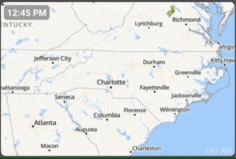

# Radar

There's several ways to get local radar into the dashboard

### NOAA Radar

The NOAA website maintains several high-resolution radar images which can be added as an Image Tile to the dashboard.

* on your phone/device, navigate to [https://www.star.nesdis.noaa.gov/GOES/index.php](https://www.star.nesdis.noaa.gov/GOES/index.php)
* select the part of the country you'd like to view radar for.. for example: [https://www.star.nesdis.noaa.gov/GOES/sector.php?sat=G16\&sector=se](https://www.star.nesdis.noaa.gov/GOES/sector.php?sat=G16\&sector=se)
* copy the URL of the "Sandwich RGB" section - the link titled "Animated GIF"
* .png>)
* In the Hubitat Dashboard, add a new Image tile
* Paste the animated GIF URL into the "URL" field and hit OK
* NOTE: The refresh rate is how often you want the app to refresh this image

### Weather.com Radar Tile

Newer versions of the Hubitat Dashboard have support for a weather.com Radar tile

* Add new Radar tile
* enter your GPS coordinates or click on "fetch" to automatically populate them
* NOTE: The refresh rate is how often you want the app to refresh this image
* 
